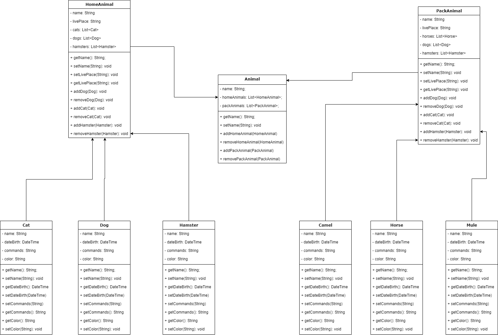

# **Итоговая контрольная работа**

**Комментарии к работе**

Выполненные задания по пунктам 1-5 находятся в папке linux

Диаграмма по пункту 6:

Дочерние классы расширяют свои родительские классы, которые в свою очередь расширяют базовый класс.

