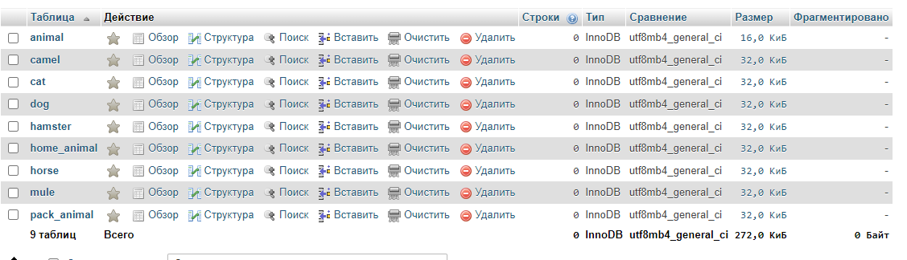
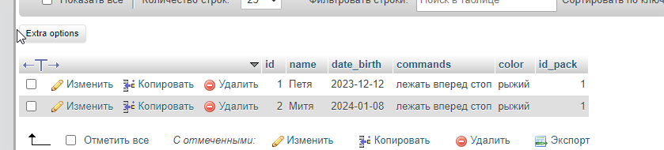
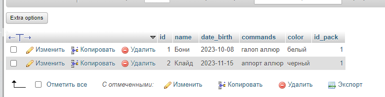
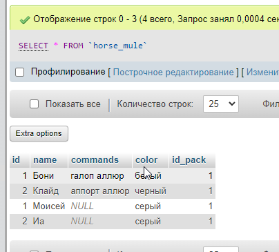
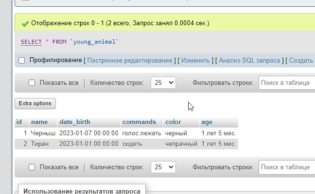
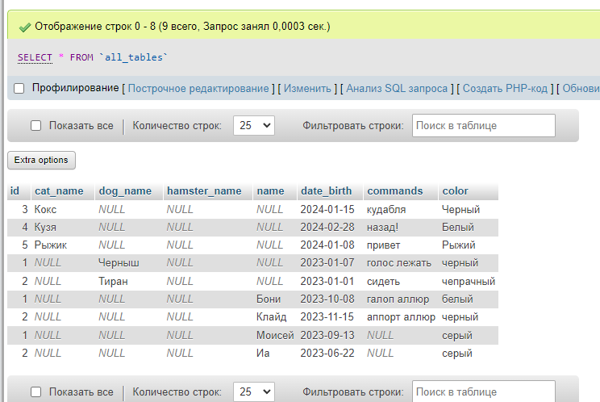

## Создание БД
```
-- Table animal

CREATE TABLE `animal`
(
  `id` Int NOT NULL AUTO_INCREMENT,
  `animal_name` Varchar(20) NOT NULL,
  PRIMARY KEY (`id`)
);

-- Table home_animal

CREATE TABLE `home_animal`
(
  `id` Int NOT NULL AUTO_INCREMENT,
  `home_name` Varchar(20) NOT NULL,
  `livePlace` Varchar(20),
  `id_animal` Int,
  PRIMARY KEY (`id`))
;

CREATE INDEX `animal_home` ON `home_animal` (`id_animal`);

-- Table cat

CREATE TABLE `cat`
(
  `id` Int NOT NULL AUTO_INCREMENT,
  `cat_name` Varchar(30) NOT NULL,
  `date_birth` Date NOT NULL,
  `commands` Varchar(200),
  `color` Varchar(20),
  `id_home` Int,
  PRIMARY KEY (`id`)
);

CREATE INDEX `home_cat` ON `cat` (`id_home`);

-- Table dog

CREATE TABLE `dog`
(
  `id` Int NOT NULL AUTO_INCREMENT,
  `dog_name` Varchar(30) NOT NULL,
  `date_birth` Date NOT NULL,
  `commands` Varchar(200),
  `color` Varchar(20),
  `id_home` Int,
  PRIMARY KEY (`id`)
);

CREATE INDEX `home_dog` ON `dog` (`id_home`);

-- Table hamster

CREATE TABLE `hamster`
(
  `id` Int NOT NULL AUTO_INCREMENT,
  `hamster_name` Varchar(30) NOT NULL,
  `date_birth` Date NOT NULL,
  `commands` Varchar(200),
  `color` Varchar(20),
  `id_home` Int,
  PRIMARY KEY (`id`)
);

CREATE INDEX `home_hamster` ON `hamster` (`id_home`);


-- Table pack_animal

CREATE TABLE `pack_animal`
(
  `id` Int NOT NULL AUTO_INCREMENT,
  `pack_name` Varchar(20) NOT NULL,
  `livePlace` Varchar(20),
  `id_animal` Int,
  PRIMARY KEY (`id`)
);

CREATE INDEX `animal_pack` ON `pack_animal` (`id_animal`);


-- Table camel

CREATE TABLE `camel`
(
  `id` Int NOT NULL AUTO_INCREMENT,
  `name` Varchar(30) NOT NULL,
  `date_birth` Date NOT NULL,
  `commands` Varchar(200),
  `color` Varchar(20),
  `id_pack` Int,
  PRIMARY KEY (`id`)
)
;

CREATE INDEX `pack_camel` ON `camel` (`id_pack`);

-- Table horse

CREATE TABLE `horse`
(
  `id` Int NOT NULL AUTO_INCREMENT,
  `name` Varchar(30) NOT NULL,
  `date_birth` Date NOT NULL,
  `commands` Varchar(200),
  `color` Varchar(20),
  `id_pack` Int,
  PRIMARY KEY (`id`)
)
;

CREATE INDEX `pack_hourse` ON `horse` (`id_pack`);

-- Table mule

CREATE TABLE `mule`
(
  `id` Int NOT NULL AUTO_INCREMENT,
  `name` Varchar(30) NOT NULL,
  `date_birth` Date NOT NULL,
  `commands` Varchar(200),
  `color` Varchar(20),
  `id_pack` Int,
  PRIMARY KEY (`id`)
)
;

CREATE INDEX `pack_mule` ON `mule` (`id_pack`);

-- Create foreign keys (relationships) section -------------------------------------------------

ALTER TABLE `home_animal` ADD CONSTRAINT `animal_to_home` FOREIGN KEY (`id_animal`) REFERENCES `animal` (`id`) ON DELETE RESTRICT ON UPDATE RESTRICT;

ALTER TABLE `cat` ADD CONSTRAINT `home_to_cat` FOREIGN KEY (`id_home`) REFERENCES `home_animal` (`id`) ON DELETE RESTRICT ON UPDATE RESTRICT;

ALTER TABLE `dog` ADD CONSTRAINT `home_to_dog` FOREIGN KEY (`id_home`) REFERENCES `home_animal` (`id`) ON DELETE RESTRICT ON UPDATE RESTRICT;

ALTER TABLE `hamster` ADD CONSTRAINT `home_to_hamster` FOREIGN KEY (`id_home`) REFERENCES `home_animal` (`id`) ON DELETE RESTRICT ON UPDATE RESTRICT;

ALTER TABLE `camel` ADD CONSTRAINT `pack_to_camel` FOREIGN KEY (`id_pack`) REFERENCES `pack_animal` (`id`) ON DELETE RESTRICT ON UPDATE RESTRICT;

ALTER TABLE `horse` ADD CONSTRAINT `pack_to_horse` FOREIGN KEY (`id_pack`) REFERENCES `pack_animal` (`id`) ON DELETE RESTRICT ON UPDATE RESTRICT;

ALTER TABLE `mule` ADD CONSTRAINT `pack_to_mule` FOREIGN KEY (`id_pack`) REFERENCES `pack_animal` (`id`) ON DELETE RESTRICT ON UPDATE RESTRICT;

```



## Заполнение БД
```
INSERT INTO `pack_animal` (`id`, `pack_name`, `livePlace`, `id_animal`) VALUES (NULL, 'Вьючное', 'Двор', '1');

INSERT INTO `home_animal` (`id`, `home_name`, `livePlace`, `id_animal`) VALUES (NULL, 'Домашнее', 'Дом', '1');

INSERT INTO `cat` (`id`, `cat_name`, `date_birth`, `commands`, `color`, `id_home`) VALUES (NULL, 'Кокс', '2024-01-15', 'кудабля', 'Черный', '2');
INSERT INTO `cat` (`id`, `cat_name`, `date_birth`, `commands`, `color`, `id_home`) VALUES (NULL, 'Кузя', '2024-02-28', 'назад!', 'Белый', '2');
INSERT INTO `cat` (`id`, `cat_name`, `date_birth`, `commands`, `color`, `id_home`) VALUES (NULL, 'Рыжик', '2024-01-08', 'привет', 'Рыжий', '2');

INSERT INTO `dog` (`id`, `dog_name`, `date_birth`, `commands`, `color`, `id_home`) VALUES (NULL, 'Черныш', '2023-01-07', 'голос лежать', 'черный', '2');
INSERT INTO `dog` (`id`, `dog_name`, `date_birth`, `commands`, `color`, `id_home`) VALUES (NULL, 'Тиран', '2023-01-01', 'сидеть', 'чепрачный', '2');

INSERT INTO `camel` (`id`, `name`, `date_birth`, `commands`, `color`, `id_pack`) VALUES (NULL, 'Петя', '2023-12-12', 'лежать вперед стоп', 'рыжий', '1')
INSERT INTO `camel` (`id`, `name`, `date_birth`, `commands`, `color`, `id_pack`) VALUES (NULL, 'Митя', '2024-01-08', 'лежать вперед стоп', 'рыжий', '1')

INSERT INTO `horse` (`id`, `name`, `date_birth`, `commands`, `color`, `id_pack`) VALUES (NULL, 'Бони', '2023-10-08', 'галоп аллюр', 'белый', '1');
INSERT INTO `horse` (`id`, `name`, `date_birth`, `commands`, `color`, `id_pack`) VALUES (NULL, 'Клайд', '2023-11-15', 'аппорт аллюр', 'черный', '1');

INSERT INTO `mule` (`id`, `name`, `date_birth`, `commands`, `color`, `id_pack`) VALUES (NULL, 'Моисей', '2023-09-13', NULL, 'серый', '1');
INSERT INTO `mule` (`id`, `name`, `date_birth`, `commands`, `color`, `id_pack`) VALUES (NULL, 'Иа', '2023-06-22', NULL, 'серый', '1');

```
коты

верблюды

лошади


## Удалить из таблицы верблюдов, т.к. верблюдов решили перевезти в другой питомник на зимовку
```
DELETE FROM `humanfriends`.`camel`
```

## Объединить таблицы лошади, и ослы в одну таблицу

```
CREATE TABLE horse_mule AS SELECT id,name,commands,color, id_pack FROM horse UNION SELECT id,name,commands,color, id_pack FROM mule;
```


## Создать новую таблицу “молодые животные”
в которую попадут все животные старше 1 года, но младше 3 лет и в отдельном столбце с точностью до месяца подсчитать возраст животных в новой таблице

```
CREATE TABLE young_animal ( id int NOT NULL, name varchar(50), date_birth Datetime, commands varchar(200), color varchar(20), age varchar(50));

INSERT INTO young_animal (id, name, date_birth, commands, color, age) SELECT id, dog_name, date_birth, commands, color, CONCAT(CAST(TIMESTAMPDIFF(YEAR, date_birth, NOW()) AS CHAR), " лет ", CAST(MOD(TIMESTAMPDIFF(MONTH, date_birth, NOW()), 12) AS CHAR), " мес.") AS age FROM dog WHERE TIMESTAMPDIFF(MONTH, date_birth, NOW()) BETWEEN 12 AND 36;
INSERT INTO young_animal (id, name, date_birth, commands, color, age) SELECT id, cat_name, date_birth, commands, color, CONCAT(CAST(TIMESTAMPDIFF(YEAR, date_birth, NOW()) AS CHAR), " лет ", CAST(MOD(TIMESTAMPDIFF(MONTH, date_birth, NOW()), 12) AS CHAR), " мес.") AS age FROM cat WHERE TIMESTAMPDIFF(MONTH, date_birth, NOW()) BETWEEN 12 AND 36;

INSERT INTO young_animal (id, name, date_birth, commands, color, age)
SELECT id, name, date_birth, commands, color,
CONCAT(CAST(TIMESTAMPDIFF(YEAR, date_birth, NOW()) AS CHAR), " лет ", 
	CAST(MOD(TIMESTAMPDIFF(MONTH, date_birth, NOW()), 12)  AS CHAR), " мес.") AS age 
FROM horse
WHERE TIMESTAMPDIFF(MONTH, date_birth, NOW()) BETWEEN 12 AND 36 
```


## Объединить все таблицы в одну, 
при этом сохраняя поля, указывающие на прошлую принадлежность к старым таблицам.
```
CREATE TABLE all_tables AS
SELECT * FROM (SELECT id, cat_name, dog_name, NULL as hamster_name, NULL as name, date_birth, commands, color FROM (
SELECT id, cat_name, NULL as dog_name, NULL AS hamster_name, NULL AS name, date_birth, commands, color FROM cat
UNION all 
SELECT id, NULL as cat_name, dog_name, NULL AS hamster_name, NULL AS name, date_birth, commands, color FROM dog) A
UNION ALL
SELECT id, NULL as cat_name, NULL as dog_name, hamster_name, NULL AS name, date_birth, commands, color FROM hamster) B
UNION ALL 
SELECT * FROM (
SELECT id, NULL AS cat_name, NULL AS dog_name, NULL AS hamster_name, name, date_birth, commands, color FROM horse
UNION ALL 
SELECT id, NULL AS cat_name, NULL AS dog_name, NULL AS hamster_name, name, date_birth, commands, color FROM mule 
) C;
```
