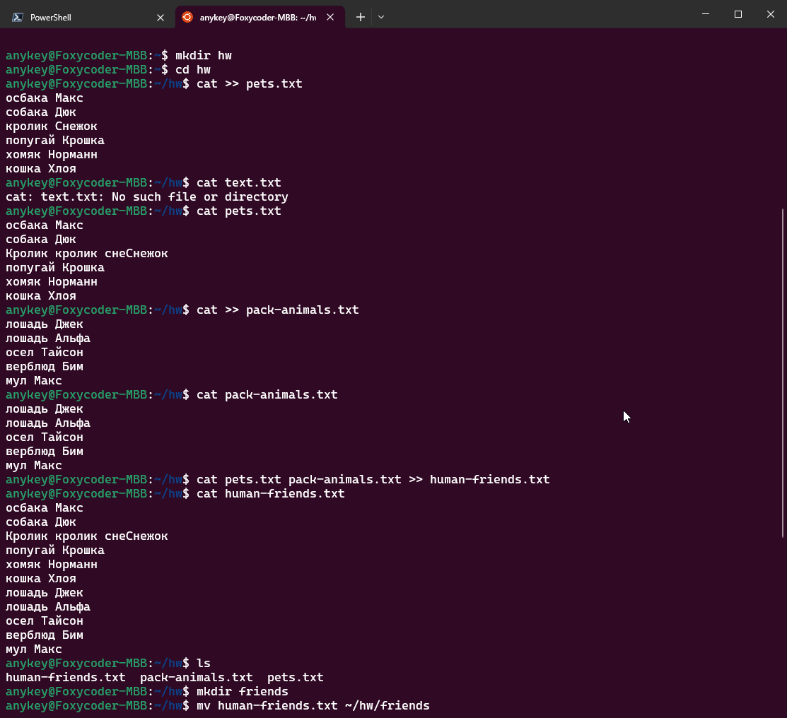
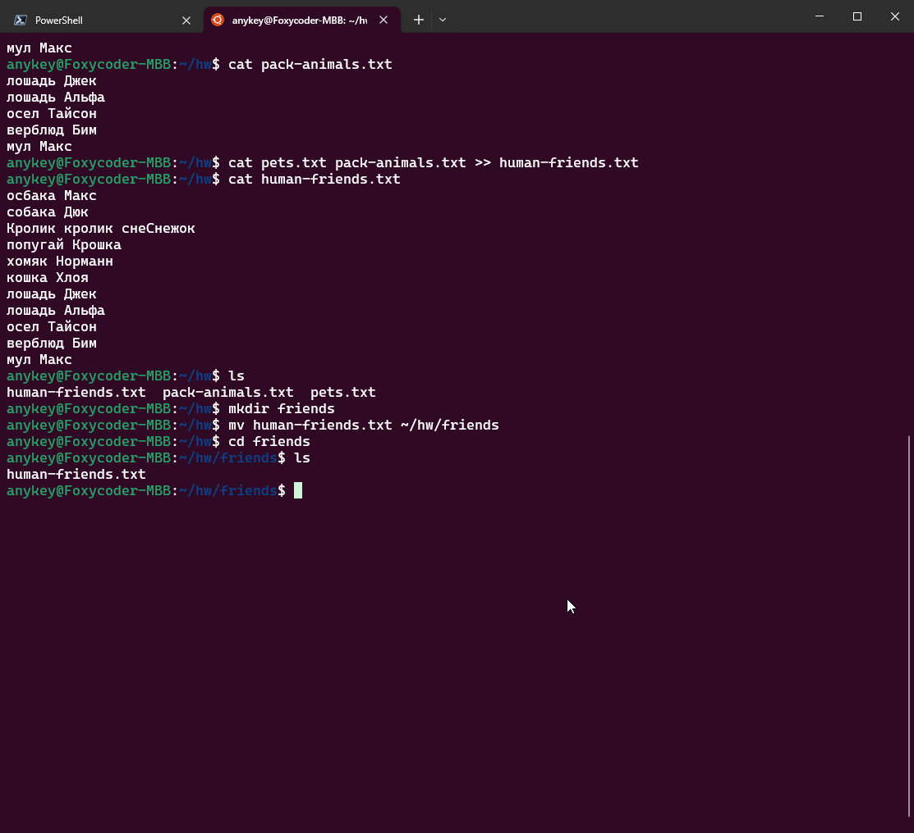

# Операционные системы и виртуализация (Linux)

## Работа с MySQL в Linux. “Установить MySQL на вашу вычислительную машину ” 

*(далее привожу текстовый лог, экспортированный из ssh клиента, поскольку скриншотить все это долго)*

Authenticating with public key "foxycoder@foxycoder-MaiBook-M"

Welcome to Ubuntu 24.04 LTS (GNU/Linux 6.8.0-31-generic x86_64)

**root@cv3803183:~#** wget <https://dev.mysql.com/get/mysql-apt-config_0.8.30-1_all.deb>

\--2024-05-20 13:47:17-- <https://dev.mysql.com/get/mysql-apt-config_0.8.30-1_all.deb>

Resolving dev.mysql.com (dev.mysql.com)... 23.211.74.232, 2a02:26f0:9500:98f::2e31, 2a02:26f0:9500:98d::2e31

Connecting to dev.mysql.com (dev.mysql.com)|23.211.74.232|:443... connected.

HTTP request sent, awaiting response... 302 Moved Temporarily

Location: <https://repo.mysql.com//mysql-apt-config_0.8.30-1_all.deb> \[following\]

\--2024-05-20 13:47:17-- <https://repo.mysql.com//mysql-apt-config_0.8.30-1_all.deb>

Resolving repo.mysql.com (repo.mysql.com)... 23.46.121.197, 2a02:26f0:6b:18e::1d68, 2a02:26f0:6b:1a4::1d68

Connecting to repo.mysql.com (repo.mysql.com)|23.46.121.197|:443... connected.

HTTP request sent, awaiting response... 200 OK

Length: 18200 (18K) \[application/x-debian-package\]

Saving to: ‘mysql-apt-config_0.8.30-1_all.deb’

mysql-apt-config_0.8.30-1_all.deb 100%\[=================================================================================================================>\] 17.77K --.-KB/s in 0s

2024-05-20 13:47:17 (149 MB/s) - ‘mysql-apt-config_0.8.30-1_all.deb’ saved \[18200/18200\]

**root@cv3803183:~#** sudo dpkg -i mysql-apt-config_0.8.30-1_all.deb

Selecting previously unselected package mysql-apt-config.

(Reading database ... 66954 files and directories currently installed.)

Preparing to unpack mysql-apt-config_0.8.30-1_all.deb ...

Unpacking mysql-apt-config (0.8.30-1) ...

Setting up mysql-apt-config (0.8.30-1) ...

**root@cv3803183:~#** sudo apt update

Hit:1 <http://ru.archive.ubuntu.com/ubuntu> noble InRelease

Get:2 <http://ru.archive.ubuntu.com/ubuntu> noble-updates InRelease \[89.7 kB\]

Get:3 <http://ru.archive.ubuntu.com/ubuntu> noble-backports InRelease \[89.7 kB\]

Get:4 <http://repo.mysql.com/apt/ubuntu> noble InRelease \[22.6 kB\]

Get:5 <http://ru.archive.ubuntu.com/ubuntu> noble-updates/main amd64 Packages \[36.9 kB\]

Get:6 <http://ru.archive.ubuntu.com/ubuntu> noble-updates/main Translation-en \[10.8 kB\]

Get:7 <http://ru.archive.ubuntu.com/ubuntu> noble-updates/universe amd64 Packages \[21.5 kB\]

Get:8 <http://ru.archive.ubuntu.com/ubuntu> noble-updates/universe Translation-en \[6,734 B\]

Get:9 <http://ru.archive.ubuntu.com/ubuntu> noble-backports/universe amd64 Packages \[6,387 B\]

Get:10 <http://ru.archive.ubuntu.com/ubuntu> noble-backports/universe Translation-en \[2,130 B\]

Get:11 <http://repo.mysql.com/apt/ubuntu> noble/mysql-8.4-lts amd64 Packages \[16.8 kB\]

Get:12 <http://repo.mysql.com/apt/ubuntu> noble/mysql-tools amd64 Packages \[4,125 B\]

Fetched 308 kB in 1s (336 kB/s)

Reading package lists... Done

Building dependency tree... Done

Reading state information... Done

10 packages can be upgraded. Run 'apt list --upgradable' to see them.

**root@cv3803183:~#** sudo apt install mysql-server mysql-client

Reading package lists... Done

Building dependency tree... Done

Reading state information... Done

The following additional packages will be installed:

libmecab2 mecab-ipadic mecab-ipadic-utf8 mecab-utils mysql-common mysql-community-client mysql-community-client-core mysql-community-client-plugins mysql-community-server mysql-community-server-core

The following NEW packages will be installed:

libmecab2 mecab-ipadic mecab-ipadic-utf8 mecab-utils mysql-client mysql-common mysql-community-client mysql-community-client-core mysql-community-client-plugins mysql-community-server

mysql-community-server-core mysql-server

0 upgraded, 12 newly installed, 0 to remove and 10 not upgraded.

Need to get 36.5 MB of archives.

After this operation, 262 MB of additional disk space will be used.

Do you want to continue? \[Y/n\] y

Get:1 <http://ru.archive.ubuntu.com/ubuntu> noble/main amd64 libmecab2 amd64 0.996-14ubuntu4 \[201 kB\]

Get:2 <http://ru.archive.ubuntu.com/ubuntu> noble/main amd64 mecab-utils amd64 0.996-14ubuntu4 \[4,804 B\]

Get:3 <http://ru.archive.ubuntu.com/ubuntu> noble/main amd64 mecab-ipadic all 2.7.0-20070801+main-3 \[6,718 kB\]

Get:4 <http://ru.archive.ubuntu.com/ubuntu> noble/main amd64 mecab-ipadic-utf8 all 2.7.0-20070801+main-3 \[4,384 B\]

Get:5 <http://repo.mysql.com/apt/ubuntu> noble/mysql-8.4-lts amd64 mysql-common amd64 8.4.0-1ubuntu24.04 \[67.3 kB\]

Get:6 <http://repo.mysql.com/apt/ubuntu> noble/mysql-8.4-lts amd64 mysql-community-client-plugins amd64 8.4.0-1ubuntu24.04 \[1,467 kB\]

Get:7 <http://repo.mysql.com/apt/ubuntu> noble/mysql-8.4-lts amd64 mysql-community-client-core amd64 8.4.0-1ubuntu24.04 \[1,825 kB\]

Get:8 <http://repo.mysql.com/apt/ubuntu> noble/mysql-8.4-lts amd64 mysql-community-client amd64 8.4.0-1ubuntu24.04 \[2,109 kB\]

Get:9 <http://repo.mysql.com/apt/ubuntu> noble/mysql-8.4-lts amd64 mysql-client amd64 8.4.0-1ubuntu24.04 \[65.9 kB\]

Get:10 <http://repo.mysql.com/apt/ubuntu> noble/mysql-8.4-lts amd64 mysql-community-server-core amd64 8.4.0-1ubuntu24.04 \[23.9 MB\]

Get:11 <http://repo.mysql.com/apt/ubuntu> noble/mysql-8.4-lts amd64 mysql-community-server amd64 8.4.0-1ubuntu24.04 \[76.0 kB\]

Get:12 <http://repo.mysql.com/apt/ubuntu> noble/mysql-8.4-lts amd64 mysql-server amd64 8.4.0-1ubuntu24.04 \[65.9 kB\]

Fetched 36.5 MB in 1s (24.8 MB/s)

Preconfiguring packages ...

Selecting previously unselected package mysql-common.

(Reading database ... 66959 files and directories currently installed.)

Preparing to unpack .../00-mysql-common_8.4.0-1ubuntu24.04_amd64.deb ...

Unpacking mysql-common (8.4.0-1ubuntu24.04) ...

Selecting previously unselected package mysql-community-client-plugins.

Preparing to unpack .../01-mysql-community-client-plugins_8.4.0-1ubuntu24.04_amd64.deb ...

Unpacking mysql-community-client-plugins (8.4.0-1ubuntu24.04) ...

Selecting previously unselected package mysql-community-client-core.

Preparing to unpack .../02-mysql-community-client-core_8.4.0-1ubuntu24.04_amd64.deb ...

Unpacking mysql-community-client-core (8.4.0-1ubuntu24.04) ...

Selecting previously unselected package mysql-community-client.

Preparing to unpack .../03-mysql-community-client_8.4.0-1ubuntu24.04_amd64.deb ...

Unpacking mysql-community-client (8.4.0-1ubuntu24.04) ...

Selecting previously unselected package mysql-client.

Preparing to unpack .../04-mysql-client_8.4.0-1ubuntu24.04_amd64.deb ...

Unpacking mysql-client (8.4.0-1ubuntu24.04) ...

Selecting previously unselected package libmecab2:amd64.

Preparing to unpack .../05-libmecab2_0.996-14ubuntu4_amd64.deb ...

Unpacking libmecab2:amd64 (0.996-14ubuntu4) ...

Selecting previously unselected package mysql-community-server-core.

Preparing to unpack .../06-mysql-community-server-core_8.4.0-1ubuntu24.04_amd64.deb ...

Unpacking mysql-community-server-core (8.4.0-1ubuntu24.04) ...

Selecting previously unselected package mysql-community-server.

Preparing to unpack .../07-mysql-community-server_8.4.0-1ubuntu24.04_amd64.deb ...

Unpacking mysql-community-server (8.4.0-1ubuntu24.04) ...

Selecting previously unselected package mecab-utils.

Preparing to unpack .../08-mecab-utils_0.996-14ubuntu4_amd64.deb ...

Unpacking mecab-utils (0.996-14ubuntu4) ...

Selecting previously unselected package mecab-ipadic.

Preparing to unpack .../09-mecab-ipadic_2.7.0-20070801+main-3_all.deb ...

Unpacking mecab-ipadic (2.7.0-20070801+main-3) ...

Selecting previously unselected package mecab-ipadic-utf8.

Preparing to unpack .../10-mecab-ipadic-utf8_2.7.0-20070801+main-3_all.deb ...

Unpacking mecab-ipadic-utf8 (2.7.0-20070801+main-3) ...

Selecting previously unselected package mysql-server.

Preparing to unpack .../11-mysql-server_8.4.0-1ubuntu24.04_amd64.deb ...

Unpacking mysql-server (8.4.0-1ubuntu24.04) ...

Setting up libmecab2:amd64 (0.996-14ubuntu4) ...

Setting up mysql-common (8.4.0-1ubuntu24.04) ...

update-alternatives: using /etc/mysql/my.cnf.fallback to provide /etc/mysql/my.cnf (my.cnf) in auto mode

Setting up mysql-community-server-core (8.4.0-1ubuntu24.04) ...

Setting up mecab-utils (0.996-14ubuntu4) ...

Setting up mysql-community-client-plugins (8.4.0-1ubuntu24.04) ...

Setting up mecab-ipadic (2.7.0-20070801+main-3) ...

Compiling IPA dictionary for Mecab. This takes long time...

reading /usr/share/mecab/dic/ipadic/unk.def ... 40

emitting double-array: 100% |###########################################|

/usr/share/mecab/dic/ipadic/model.def is not found. skipped.

reading /usr/share/mecab/dic/ipadic/Postp.csv ... 146

reading /usr/share/mecab/dic/ipadic/Auxil.csv ... 199

reading /usr/share/mecab/dic/ipadic/Symbol.csv ... 208

reading /usr/share/mecab/dic/ipadic/Noun.verbal.csv ... 12146

reading /usr/share/mecab/dic/ipadic/Noun.name.csv ... 34202

reading /usr/share/mecab/dic/ipadic/Noun.csv ... 60477

reading /usr/share/mecab/dic/ipadic/Noun.place.csv ... 72999

reading /usr/share/mecab/dic/ipadic/Adj.csv ... 27210

reading /usr/share/mecab/dic/ipadic/Conjunction.csv ... 171

reading /usr/share/mecab/dic/ipadic/Interjection.csv ... 252

reading /usr/share/mecab/dic/ipadic/Others.csv ... 2

reading /usr/share/mecab/dic/ipadic/Noun.adverbal.csv ... 795

reading /usr/share/mecab/dic/ipadic/Noun.adjv.csv ... 3328

reading /usr/share/mecab/dic/ipadic/Filler.csv ... 19

reading /usr/share/mecab/dic/ipadic/Verb.csv ... 130750

reading /usr/share/mecab/dic/ipadic/Noun.proper.csv ... 27328

reading /usr/share/mecab/dic/ipadic/Adnominal.csv ... 135

reading /usr/share/mecab/dic/ipadic/Noun.others.csv ... 151

reading /usr/share/mecab/dic/ipadic/Postp-col.csv ... 91

reading /usr/share/mecab/dic/ipadic/Prefix.csv ... 221

reading /usr/share/mecab/dic/ipadic/Noun.nai.csv ... 42

reading /usr/share/mecab/dic/ipadic/Noun.org.csv ... 16668

reading /usr/share/mecab/dic/ipadic/Noun.demonst.csv ... 120

reading /usr/share/mecab/dic/ipadic/Adverb.csv ... 3032

reading /usr/share/mecab/dic/ipadic/Noun.number.csv ... 42

reading /usr/share/mecab/dic/ipadic/Suffix.csv ... 1393

emitting double-array: 100% |###########################################|

reading /usr/share/mecab/dic/ipadic/matrix.def ... 1316x1316

emitting matrix : 100% |###########################################|

done!

update-alternatives: using /var/lib/mecab/dic/ipadic to provide /var/lib/mecab/dic/debian (mecab-dictionary) in auto mode

Setting up mysql-community-client-core (8.4.0-1ubuntu24.04) ...

Setting up mecab-ipadic-utf8 (2.7.0-20070801+main-3) ...

Compiling IPA dictionary for Mecab. This takes long time...

reading /usr/share/mecab/dic/ipadic/unk.def ... 40

emitting double-array: 100% |###########################################|

/usr/share/mecab/dic/ipadic/model.def is not found. skipped.

reading /usr/share/mecab/dic/ipadic/Postp.csv ... 146

reading /usr/share/mecab/dic/ipadic/Auxil.csv ... 199

reading /usr/share/mecab/dic/ipadic/Symbol.csv ... 208

reading /usr/share/mecab/dic/ipadic/Noun.verbal.csv ... 12146

reading /usr/share/mecab/dic/ipadic/Noun.name.csv ... 34202

reading /usr/share/mecab/dic/ipadic/Noun.csv ... 60477

reading /usr/share/mecab/dic/ipadic/Noun.place.csv ... 72999

reading /usr/share/mecab/dic/ipadic/Adj.csv ... 27210

reading /usr/share/mecab/dic/ipadic/Conjunction.csv ... 171

reading /usr/share/mecab/dic/ipadic/Interjection.csv ... 252

reading /usr/share/mecab/dic/ipadic/Others.csv ... 2

reading /usr/share/mecab/dic/ipadic/Noun.adverbal.csv ... 795

reading /usr/share/mecab/dic/ipadic/Noun.adjv.csv ... 3328

reading /usr/share/mecab/dic/ipadic/Filler.csv ... 19

reading /usr/share/mecab/dic/ipadic/Verb.csv ... 130750

reading /usr/share/mecab/dic/ipadic/Noun.proper.csv ... 27328

reading /usr/share/mecab/dic/ipadic/Adnominal.csv ... 135

reading /usr/share/mecab/dic/ipadic/Noun.others.csv ... 151

reading /usr/share/mecab/dic/ipadic/Postp-col.csv ... 91

reading /usr/share/mecab/dic/ipadic/Prefix.csv ... 221

reading /usr/share/mecab/dic/ipadic/Noun.nai.csv ... 42

reading /usr/share/mecab/dic/ipadic/Noun.org.csv ... 16668

reading /usr/share/mecab/dic/ipadic/Noun.demonst.csv ... 120

reading /usr/share/mecab/dic/ipadic/Adverb.csv ... 3032

reading /usr/share/mecab/dic/ipadic/Noun.number.csv ... 42

reading /usr/share/mecab/dic/ipadic/Suffix.csv ... 1393

emitting double-array: 100% |###########################################|

reading /usr/share/mecab/dic/ipadic/matrix.def ... 1316x1316

emitting matrix : 100% |###########################################|

done!

update-alternatives: using /var/lib/mecab/dic/ipadic-utf8 to provide /var/lib/mecab/dic/debian (mecab-dictionary) in auto mode

Setting up mysql-community-client (8.4.0-1ubuntu24.04) ...

Setting up mysql-client (8.4.0-1ubuntu24.04) ...

Setting up mysql-community-server (8.4.0-1ubuntu24.04) ...

update-alternatives: using /etc/mysql/mysql.cnf to provide /etc/mysql/my.cnf (my.cnf) in auto mode

dpkg: error processing package mysql-community-server (--configure):

installed mysql-community-server package post-installation script subprocess returned error exit status 1

dpkg: dependency problems prevent configuration of mysql-server:

mysql-server depends on mysql-community-server (= 8.4.0-1ubuntu24.04); however:

Package mysql-community-server is not configured yet.

dpkg: error processing package mysql-server (--configure):

dependency problems - leaving unconfigured

Processing triggers for man-db (2.12.0-4build2) ...

No apport report written because the error message indicates its a followup error from a previous failure.

Processing triggers for libc-bin (2.39-0ubuntu8.1) ...

Errors were encountered while processing:

mysql-community-server

mysql-server

needrestart is being skipped since dpkg has failed

E: Sub-process /usr/bin/dpkg returned an error code (1)

**root@cv3803183:~#** mysql --version

mysql Ver 8.4.0 for Linux on x86_64 (MySQL Community Server - GPL)

**root@cv3803183:~#**  sudo apt purge mysql-server mysql-client

Reading package lists... Done

Building dependency tree... Done

Reading state information... Done

The following packages were automatically installed and are no longer required:

libmecab2 mecab-ipadic mecab-ipadic-utf8 mecab-utils mysql-common mysql-community-client mysql-community-client-core mysql-community-client-plugins mysql-community-server-core

Use 'sudo apt autoremove' to remove them.

The following packages will be REMOVED:

mysql-client\* mysql-community-server\* mysql-server\*

0 upgraded, 0 newly installed, 3 to remove and 10 not upgraded.

After this operation, 296 kB disk space will be freed.

Do you want to continue? \[Y/n\] y

(Reading database ... 67385 files and directories currently installed.)

Removing mysql-server (8.4.0-1ubuntu24.04) ...

Removing mysql-community-server (8.4.0-1ubuntu24.04) ...

update-alternatives: using /etc/mysql/my.cnf.fallback to provide /etc/mysql/my.cnf (my.cnf) in auto mode

Removing mysql-client (8.4.0-1ubuntu24.04) ...

(Reading database ... 67359 files and directories currently installed.)

Purging configuration files for mysql-community-server (8.4.0-1ubuntu24.04) ...

**root@cv3803183:~#** sudo dpkg -r mysql-apt-config

(Reading database ... 67355 files and directories currently installed.)

Removing mysql-apt-config (0.8.30-1) ...

**root@cv3803183:~#**
